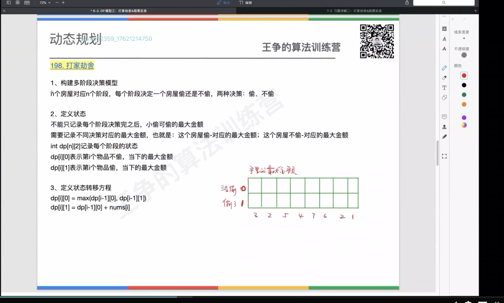

一般动态规划问题，上一个阶段做了什么决策，不影响下一阶段的决策。

而打家劫舍&股票买卖问题，上一阶段的决策会影响下一阶段的决策。

所以，每隔阶段都需要记录不同的决策对应的最值，而不是一个全局的最值。

# 包含线性 DP 和树形 DP

## 线性 DP(打家劫舍 1 和 2)

1、构建多阶段决策模型
n 个房屋对应 n 个阶段，每个阶段决定一个房屋偷还是不偷。 两种决策：偷、不偷。

2、定义状态
不能只记录每个阶段决策完之后，小偷可偷的最大金额。
**需要记录不同决策对应的最大金额**，也就是：这个房屋偷对应的最大金额；这个房屋不偷对应的最大金额。

dp[n][2] 记录每个阶段的状态
dp[i][0]表示第 i 个物品不偷，当下的最大金额
dp[i][1]表示第 i 个物品偷， 对应的最大金额

3、定义状态转移方程
dp[i][0] = max(dp[i-1][0], dp[i-1][1]);
dp[i][1] = dp[i-1][0] + nums[i]

## 树形 DP(打家劫舍 3)

1、构建多阶段决策模型
树形 DP 基于树这种数据结构上做状态推导， 一般都是从下往上推，子节点状态推导父节点状态。一般都是基于**后序遍历**来实现。

2、状态定义
每个节点都有两个状态：偷、不偷
int money[2] 表示每个节点的状态
money[0] 表示不偷此节点，当下的最大金额
money[1] 表示选择偷此节点，当下的最大金额

3、定义状态转移方程
root.money[0] = max(left.money[0], left.money[1]) +max(right.money[0], right.money[1]);
root.money[1] = left.money[0] + right.money[0] + root.val
