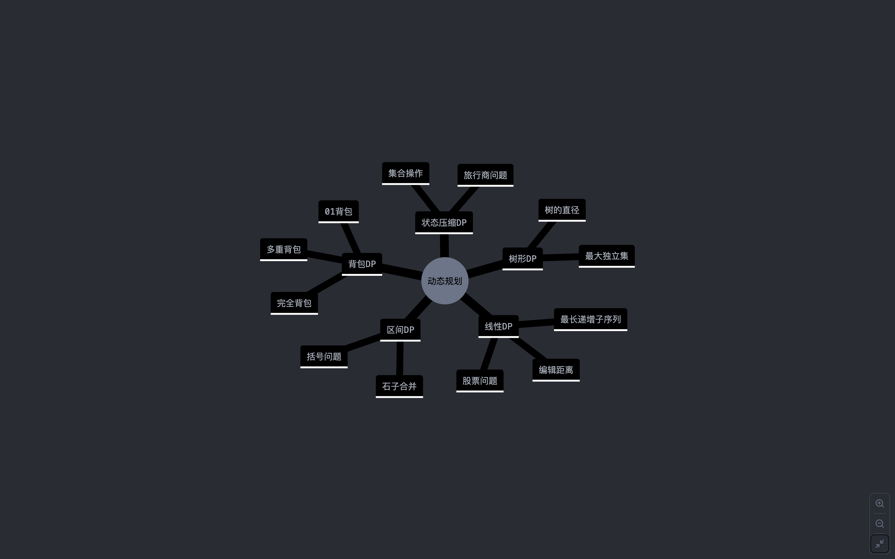

# 掌握动态规划的系统方法

## 解题模式总结

### 数组取 n，数字和字符串取 n+1

### dp 数组定义：布尔数组、数字数组、整数数组

- 可行性问题， 一般都是建立布尔数组 dp[i] = true/false
- 最值问题， 一般都是建立数字数组 dp[i] = Number.MAX_SAFE_INTEGER/Number.MIN_SAFE_INTEGER
- 计数问题， 一般都是建立整数数组 dp[i] = 0/1

## 建立解题模板

```
1. 状态是什么？
   - 要求的最终结果是什么
   - 变化的量是什么

2. dp数组定义
   dp[i] 代表什么含义？

3. 状态转移方程
   dp[i] = 某种运算(dp[i-1], dp[i-2], ...)

4. 初始化
   dp[0] = ?
   dp[1] = ?

5. 遍历顺序
   - 从前到后？
   - 从后到前？

6. 返回值
   return dp[n] 还是 max(dp) ？
```

## 题型分类记忆



## 练习方法

- 循序渐进：

  - 先从简单的线性 DP 开始
  - 重复练习相似题目，建立联系
  - 逐步过渡到复杂题型

- 题解记录

```
题目：xxx

1. 理解：
   - 这道题要求什么
   - 有什么限制条件

2. 思路：
   - 为什么用DP
   - dp[i]代表什么

3. 难点：
   - 卡住的地方
   - 如何突破

4. 相似题目：
   - 题号xxx
   - 关联点xxx
```

- 常见错误总结

  - 初始化错误：
  - 遍历顺序错误：
  - 边界条件处理：

- 建立知识联系

  - 找到题目间的共同点
  - 总结解题模式
  - 建立知识图谱
  - 多做变形题目
