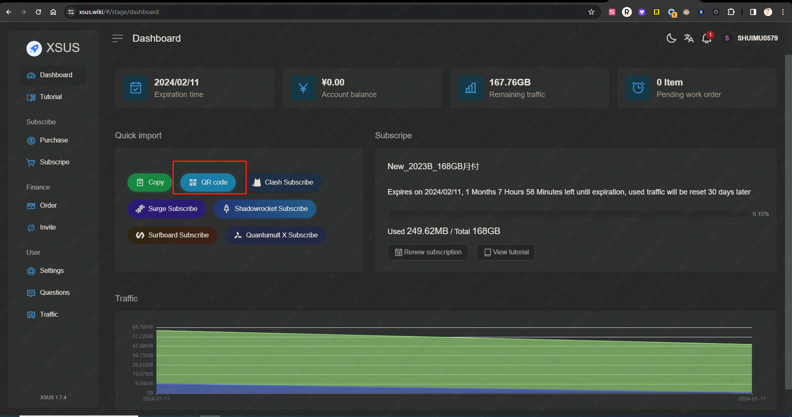

# 科学上网：shadowrocket(小火箭) + 节点

科学上网：需要两个东西，一个是类似于shadowrocket(小火箭)这样的代理，一个是服务器节点， 两者缺一不可。

之前用过的 Veee+ 这样的VPN 就是把代理和 服务器节点 集成在一起。Veee+ 这个代理现在访问不了了，只能等着官方修复。

## 节点地址(8元/月，按量计费，168G额度): 

邀请链接：<https://xsus.wiki/#/register?code=aOFe3Zq2>

个人登录链接：<https://xsus.wiki/#/stage/dashboard>

## iPhone版本shadowrocket：

### iPhone版本小火箭怎么下载：

美区appleID 下载 shadowrocket

### iPhone版本小火箭如何配置节点：

怎么配置节点？打开节点链接( <https://xsus.wiki/#/stage/dashboard> ), 使用你的IPhone手机扫码

## Windows版本shadowrocket：

### windows版本小火箭怎么下载：

<https://github.com/shadowsocks/shadowsocks-windows/releases/>

### windows版本小火箭如何配置节点：

<https://xipcloud.net/index.php?rp=%2Fknowledgebase%2F11%2FWindows-Shadowsocks-for-Windows-%E4%BD%BF%E7%94%A8%E6%95%99%E7%A8%8B.html&language=dutch>

怎么获取到节点订阅链接？打开节点链接( <https://xsus.wiki/#/stage/dashboard> ), 点击Copy按钮

## Mac版本shadowrocket:

### Mac版本小火箭怎么下载：

用美区appleID，在Mac 的 App Store中下载。

### Mac版本小火箭如何配置节点：

怎么配置节点？打开节点链接( <https://xsus.wiki/#/stage/dashboard> ), 点击 `Shadowrocket Subscribe` ， 跟着提示走。

